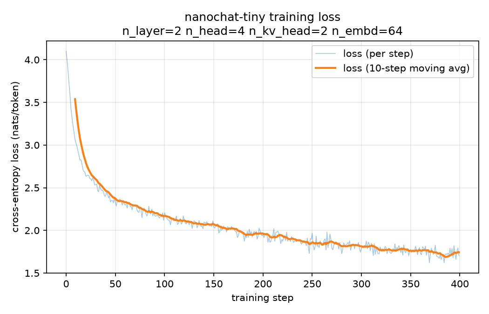

# nanochat × onnxsim demo

[nanochat](https://github.com/karpathy/nanochat) is Andrej Karpathy's
from-scratch, full-stack "best ChatGPT you can train for ~$100" pipeline:
tokenizer training, base pretraining, midtraining/SFT, RL, and a chat web UI,
all built around a GPT defined in `nanochat/gpt.py`. That model's own
docstring lists its notable features: rotary embeddings (no positional
embeddings), QK norm, untied token-embedding/`lm_head` weights, `relu^2`
activation in the MLP, a norm after the token embedding, no learnable params
in RMSNorm, no bias in linear layers, and Group-Query Attention (GQA).

nanochat has **no ONNX export path of its own** to reproduce (unlike the
`scripts/yolo` / `scripts/rfdetr` harnesses, which replay an existing
package's real `simplify=True` / `onnxsim.simplify(...)` call). Its
attention backend, `nanochat/flash_attention.py`, is Flash Attention 3 -- a
custom CUDA kernel that does not trace through `torch.onnx.export` -- run
with a sliding-window pattern across layers that plain SDPA doesn't support
either. nanochat's own `scripts/base_train.py` warns about exactly this:

> WARNING: SDPA has no support for sliding window attention
> (window_pattern='SSSL'). Your GPU utilization will be terrible.
> WARNING: Recommend using --window-pattern L for full context attention
> without alternating sliding window patterns.

So this demo is, itself, the export path: [`model.py`](model.py) is a
standalone, ONNX-exportable reimplementation of nanochat's *core*
architecture -- same rotary/QK-norm/untied-embedding/`relu^2`/GQA/no-bias/
unlearned-RMSNorm structure as upstream, with full (non-windowed) causal
attention computed via plain matmul + softmax in place of Flash Attention 3,
and without the KV-cache / value-embedding / "smear"+"backout" residual
tricks / per-layer learnable scalars / Muon optimizer that only matter for
training or incremental decoding. See `model.py`'s module docstring for the
exact diff against `nanochat/gpt.py`.

## Files

- **`model.py`** -- the GPT reimplementation, plus `config_for_depth()`,
  which reproduces nanochat's own depth -> `(n_layer, n_head, n_embd)`
  sizing formula from `scripts/base_train.py`'s `build_model_meta()`.
- **`train_tiny.py`** -- trains the model on a bundled 64KB slice of the
  ["tinyshakespeare"](data/tinyshakespeare_sample.txt) dataset (the same
  char-level demo corpus used across Karpathy's own
  char-rnn/minGPT/nanoGPT tutorials) with a plain character tokenizer, and
  plots the training loss curve with matplotlib.
- **`simplify_nanochat.py`** -- exports a model (random weights by default,
  or `--checkpoint` from `train_tiny.py`) to ONNX and simplifies it with
  onnxsim, reporting node counts before/after.
- **`nanochat_wasm_demo.onnx`** -- a tiny (34KB, unsimplified) export
  committed here so it can be dropped straight into the browser wasm UI (see
  below) without installing anything.

## Running the training + loss-curve demo

```bash
pip install torch matplotlib
python scripts/nanochat/train_tiny.py --steps 400 --checkpoint ckpt.pt
```

This trains a 2-layer, 64-dim GQA model (`n_head=4`, `n_kv_head=2`) on
~65K characters of Shakespeare for 400 steps (a few seconds on a laptop
CPU), prints the loss every 20 steps, and saves `loss_curve.png`:



Loss goes from ~4.1 (`ln(59)` ≈ 4.08 -- random-guess entropy over the
59-character vocabulary) down to ~1.7 nats/token. Pass `--checkpoint` to
also save the trained weights for the export step below.

## Running the export + onnxsim harness

```bash
pip install torch onnxruntime onnxsim
python scripts/nanochat/simplify_nanochat.py --depth 4 --depth 12
python scripts/nanochat/simplify_nanochat.py --checkpoint ckpt.pt   # export trained weights instead
```

`onnxruntime` is not optional: onnxsim uses it for the `check_n=3` numerical
equivalence check between the original and simplified graphs. See
[`RESULTS.md`](RESULTS.md) for a captured run.

## Regression test

`tests/test_nanochat.py` is the automated counterpart: it builds a tiny
random-weight model in both MHA (`n_kv_head == n_head`) and GQA
(`n_kv_head < n_head`) configurations, exports each, and runs it through
onnxsim's `check_n=3` verification.

## Try it in the browser wasm UI

**[onnxsim.github.io/onnxsim](https://onnxsim.github.io/onnxsim/)** (source:
`scripts/convertmodel/index.html`) has a one-click **"Load nanochat demo
model"** button under "Convert a model", right below the Hugging Face
loader. It fetches `nanochat_wasm_demo.onnx` same-origin (bundled with the
deployed page -- see `scripts/convertmodel/nanochat_demo.mjs` for the glue,
which mirrors `hf_load.mjs`'s hand-off to the converter/Netron/inference
panels) and runs it straight through Simplify. Hit **Simplify**, and the
before/after Netron panes show rotary embeddings' `Slice`/`Concat` pairs,
the QK-norm `Pow`/`ReduceMean`/`Sqrt` chain, the GQA `Tile` (from
`repeat_interleave`), and the `relu^2` MLP getting folded down, live.

Both of this repo's in-browser tools also accept any local `.onnx` file
through a plain file picker -- no upload, no build step, and no dependence
on the button above:

- **onnxsim.github.io/onnxsim** -- use the file input under "Convert a
  model" and pick [`nanochat_wasm_demo.onnx`](nanochat_wasm_demo.onnx)
  (or any other export from this directory) directly.
- **`scripts/pyodide_demo/index.html`** -- runs full Python
  `onnxsim.simplify()` in-browser via Pyodide (see `docs/wasm_pyodide.md`);
  serve the directory and pick the same `.onnx` file at step 2. (No
  one-click button here -- the Pyodide demo is a separate, smaller page.)

`nanochat_wasm_demo.onnx` is the *unsimplified* export of `model.py`'s
`_WASM_DEMO_CONFIG` (1 layer, `n_head=2`, `n_kv_head=1` -- so GQA's
`repeat_interleave` shows up too -- `n_embd=16`, 8-way-padded 32-token
vocab, 8-token context; 169 nodes, 3,840 params) -- small enough to commit
and load instantly, but big enough to carry every op the harness above
exercises at larger scale. It is committed **twice**: once here for the
Python-side docs/fixtures, and once under `scripts/convertmodel/` so the
deployed converter page can fetch it same-origin (that directory is what
`static.yml` uploads as the Pages artifact). Regenerate both with:

```bash
python scripts/nanochat/simplify_nanochat.py --tiny --output-dir .
cp nanochat_tiny.onnx nanochat_wasm_demo.onnx                          # keep the *unsimplified* export
cp nanochat_wasm_demo.onnx ../convertmodel/nanochat_wasm_demo.onnx     # keep both copies in sync
```
